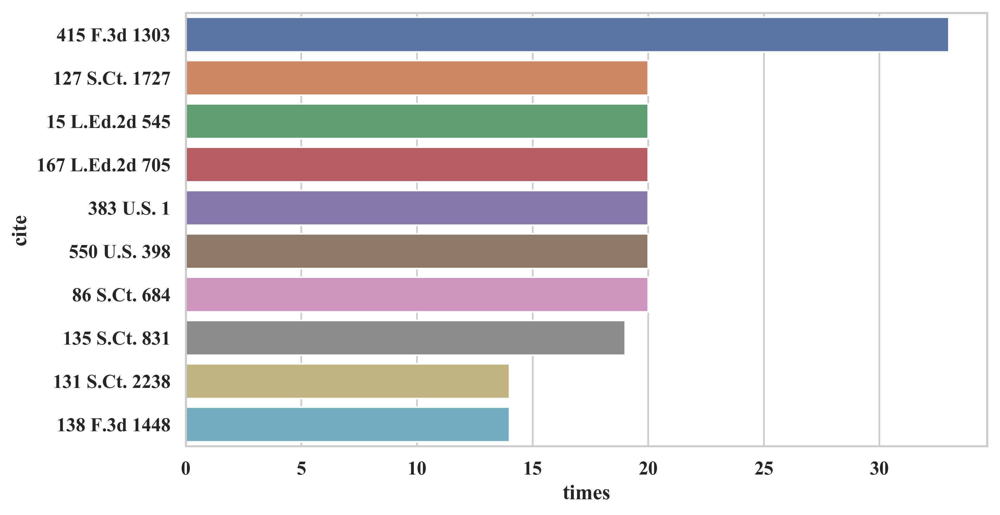
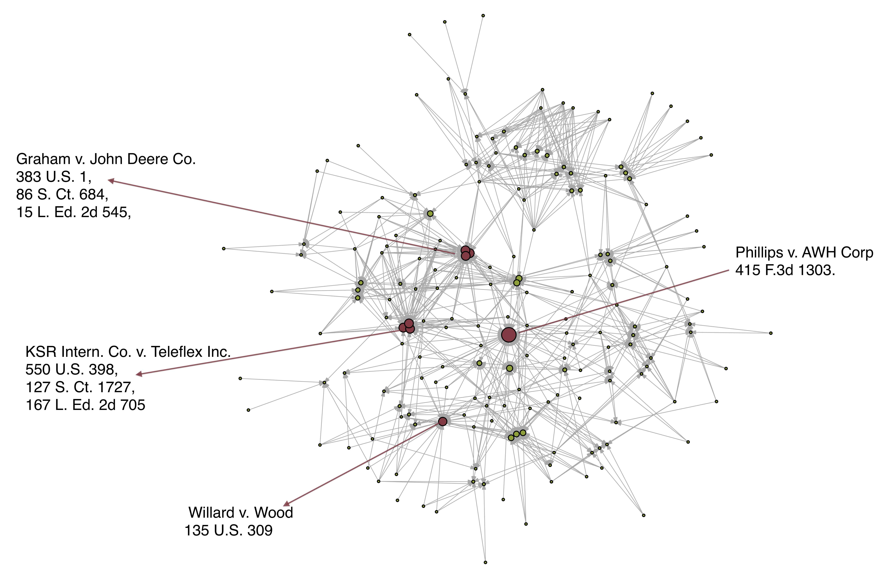
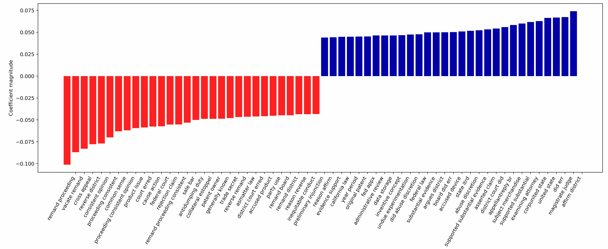

# Automation on Legal Court Cases Review

This project is to automate the case review on legal case documents and find the most critical cases using network analysis. 

[Short write-up](https://yidatadive.com/patent-law.html)

**Affiliation**: [Institute for Social and Economic Research and Policy](http://iserp.columbia.edu/), Columbia University

## Project Information:

**Keywords**: Automation, PDF parse, String Extraction, Network Analysis

**Software**:  

- Python : `pdfminer`, `LexNLP`, `nltk` `sklearn`
- R:  `igraph`

**Scope:** 

1. Parse court documents, extract citations from raw text.
2. Build citation network, identify important cases in the network.
3. Extract judge's opinion text and meta information including opinion author, court, decision.
4. Model training to predict court decision based on opinion text.

## Polit Study on 159 Legal Court Documents (in `pilot_159` folder)

### 1. Process PDF documents using `Python` 

| Ipython Notebook                        | Description                                                  |
| --------------------------------------- | ------------------------------------------------------------ |
| `1.Extraction by LexNLP.ipynb`          | Extract meta inforation use `LexNLP` package.                |
| `2.Layer Analysis on Sigle File. ipynb` | Use `pdfminer` to extract the raw text and the *paragraph segamentation* in the PDF document. |
| `3.Patent Position by Layer.ipynb`      | Identify the position of patent number in extracted layers from PDF. |
| `4.Opinion and Author by Layer.ipynb`   | Extract opinion text, author, decisions from the layers list. |
| `5.Wrap up to Meta Data.ipynb`          | Store extracted meta data to `.json` or `.csv`               |
| `6.Visualize citation frequency.ipynb`  | Bar plot of the citation frequencies                         |

### 2. Data: Parse PDF documents via `Python`

*These datasets are NOT included in this public repository for intellectual property and privacy concern*

| File                    |                                                              |
| ----------------------- | ------------------------------------------------------------ |
| `pdf2text159.json`      | A dictionary of 3 list: `file_name`, `raw_text`, `layers`.   |
| `cite_edge159.csv`      | Edge list of citation network                                |
| `cite_node159.csv`      | Meta information of each case: `case_number`, `court`, `dates` |
| `reference_extract.csv` | cited cases in a list for every case, untidy format for analysis |
| `citation159.csv`       | file citation pair, tidy format for calculation              |
| `regulation159.csv`     | file regulation pair, tidy format for calculation            |

### 3. Analyze and Visualize using `R`

| File                               |                                 |
| ---------------------------------- | ------------------------------- |
| `Calculate Citation Frequency.Rmd` | Analyze `reference_extract.csv` |
| `Citation Network.Rmd`             | Analyze `cite_edge159`          |

### 4. Visulization Chart Sample

#### Citation Frequency

#### Citation Network

## Network Visulization and Predictive Modeling on 854 Legal Court Cases (in `Extraction_Modelling` folder)

### 1. Extract opinion and meta information from raw text data

| `.ipynb` notebook          | Description                                              |
| -------------------------- | -------------------------------------------------------- |
| `Full Dataset Merge.ipynb` | Merge the 854 cases dataset                              |
| `Edge and Node List.ipynb` | Create edge and node list                                |
| `Full Extractions.ipynb`   | Extract author, judge panel, opinion text                |
| `Clean Opinion Text.ipynb` | Remove references and special characters in opinion text |

### 2. Datasets 

*These datasets are NOT included in this public repository for intellectual property and privacy concern*

| Dataset               | Description                                                  |
| --------------------- | ------------------------------------------------------------ |
| `amy_cases.json`      | large dictionary {file name: raw text} for 854 cases, from Lilian's PDF parsing |
| `full_name_text.json` | convert `amy_cases.json` key value pair to two list: `file_name`, `raw_text` |
| `cite_edge.csv`       | edge list of citation                                        |
| `cite_node.csv`       | node list contains `case_code`, `case_name`, `court_from`, `court_type` |
| `extraction854.csv`   | full extractions include `case_code`, `case_name`, `court_from`, `court_type`, `result`, `author`, `judge_panel` |
| `decision_text.json`  | json file include `author`, `decision`(result of the case), `opinion` (opinion text), `cleaned_text` (cleaned opinion text) |
| `cleaned_text.csv`    | csv file contains allt the cleaned text                      |
| `predict_data.csv`    | cleaned dataset for NLP modeling predict court decision      |

### 3. Visulization using R

| R markdown file                           |                                               |
| ----------------------------------------- | --------------------------------------------- |
| `Full Network Graph.Rmd`                  | draw the full citation network                |
| `Citation Betwwen Nodes.Rmd`              | draw citation between all the available cases |
| `Clean Data For Predictive Modelling.rmd` | clean text data for predictive modeling       |

#### Full Citation Network (all cases and cited cases)

#### Citation Between Available Cases

### 4. Predictive Modeling using Python

| `ipynb` notebook                |                                                              |
| ------------------------------- | ------------------------------------------------------------ |
| `NLP Predictive Modeling.ipynb` | Try different preprocessing, and build a logistic regression to predict court decision. |

#### Visulization of the Bi-gram (words) with the strongest coefficient

